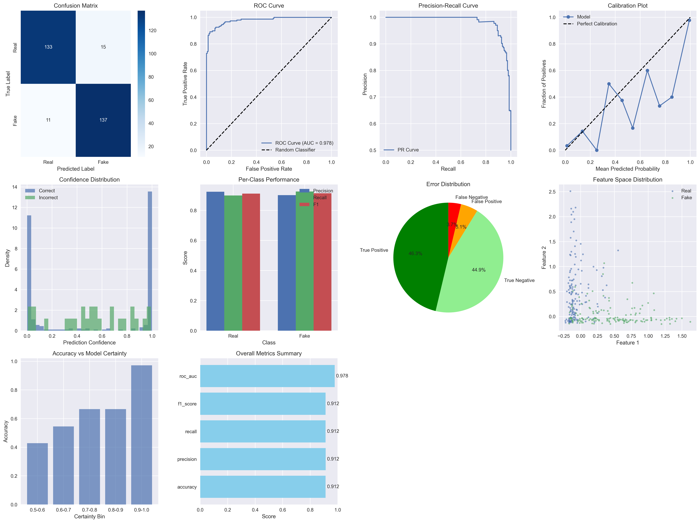

# Deepfake Detection System

This repository contains a comprehensive system for detecting deepfake videos and images, built with PyTorch. The project goes beyond simple classification by including modules for in-depth model evaluation, explainability via Grad-CAM, and a thorough analysis of the ethical implications of deepfake technology.


*Figure: Comprehensive evaluation results dashboard.*

## Table of Contents
- [Project Objective](#project-objective)
- [Features](#features)
- [System Architecture](#system-architecture)
- [Getting Started](#getting-started)
  - [Prerequisites](#prerequisites)
  - [Installation](#installation)
- [Usage](#usage)
  - [1. Data Preprocessing](#1-data-preprocessing)
  - [2. Training the Model](#2-training-the-model)
  - [3. Running the Full Pipeline](#3-running-the-full-pipeline)
- [Evaluation and Ethics](#evaluation-and-ethics)
- [Explainability](#explainability)
- [Live API Endpoint](#live-api-endpoint)

## Project Objective

The goal of this project is to develop a robust deepfake detection tool while critically addressing the ethical considerations inherent in such technology. It aims to serve as a starting point for creating responsible and transparent AI systems for media verification.

## Features

- **CNN-Based Classifier**: Uses a pre-trained EfficientNet model for high-accuracy classification of real vs. fake images.
- **End-to-End Pipeline**: A single script (`main.py`) handles data preprocessing, training, evaluation, and submission file generation.
- **Comprehensive Evaluation**: Generates a rich dashboard of metrics, including accuracy, precision, recall, ROC-AUC, confusion matrix, and calibration plots.
- **Explainable AI (XAI)**: Integrates Grad-CAM to visualize which parts of an image the model focuses on, making its decisions more transparent.
- **Ethical Analysis**: Automatically generates a detailed ethics report (`ethics_report.md`) discussing potential biases, societal impact, and recommendations for responsible deployment.
- **Competition Ready**: Includes a script to generate a `submission.csv` file for platforms like Kaggle.

## System Architecture

The project is organized into modular Python scripts:

- `main.py`: The central script that orchestrates the entire pipeline.
- `data_utils.py`: Handles downloading, processing the DFDC dataset, and creating data splits.
- `deepfake_starter_code.py`: Defines the `DeepfakeDetector` model, `DeepfakeDataset` class, and the `DeepfakeTrainer`.
- `evaluation_ethics.py`: Contains the `ComprehensiveEvaluator` and `EthicsAnalyzer` classes for robust evaluation and ethical reporting.
- `requirements.txt`: Lists all the necessary Python packages.

## Getting Started

### Prerequisites

- Python 3.8+
- [PyTorch](https://pytorch.org/)
- [OpenCV](https://opencv.org/)
- Access to the DeepFake Detection Challenge (DFDC) dataset or a similar dataset of real and fake videos.

### Installation

1.  **Clone the repository:**
    ```bash
    git clone <your-repo-url>
    cd deepfake-detection
    ```

2.  **Install dependencies:**
    ```bash
    pip install -r requirements.txt
    ```

3.  **Download the Dataset:**
    - Download the DFDC dataset.
    - Place the `train_sample_videos` and `test_videos` folders inside a `DFDC/` directory in the project root.
    - Your structure should look like this:
      ```
      deepfake-detection/
      ├── DFDC/
      │   ├── train_sample_videos/
      │   └── test_videos/
      ├── main.py
      └── ...
      ```

## Usage

The `main.py` script is the main entry point for all operations.

### 1. Data Preprocessing

The first time you run the script, it will automatically process the videos, extract face frames, and create balanced training, validation, and test splits. This is a one-time setup.

```bash
python main.py
```

This will create a `processed_data/` directory containing the extracted frames and `.csv` files for the data splits.

### 2. Training the Model

If a trained model (`best_deepfake_model.pth`) is not found in the `output/` directory, the script will automatically start training. You can configure the number of epochs and other settings in `main.py`.

### 3. Running the Full Pipeline

To run the entire pipeline from start to finish (data processing -> training -> evaluation -> ethics report -> submission), simply execute:

```bash
python main.py
```

The script is smart enough to skip steps that have already been completed (e.g., it will load the pre-processed data and the trained model if they exist).

## Evaluation and Ethics

After training, the system automatically evaluates the model on the test set and saves a detailed plot of the results to `output/evaluation_results.png`.

Simultaneously, it generates a markdown report at `output/ethics_report.md`, which provides a qualitative analysis of the model's ethical risks and responsible deployment strategies.

## Explainability

As part of the pipeline, the system uses Grad-CAM to explain a sample prediction on a fake image. The visualization is saved to `output/grad_cam_example.png`, showing the areas of the image that the model used to make its "fake" classification.


*Figure: Grad-CAM visualization highlighting influential regions for a "fake" prediction.*

## Live API Endpoint

This project has been containerized with Docker and is deployed as a live web service on Render.

**API URL**: [https://deepfake-detector-api-vdin.onrender.com](https://deepfake-detector-api-vdin.onrender.com)

You can interact with the live API directly through its documentation:

**Interactive API Docs**: [https://deepfake-detector-api-vdin.onrender.com/docs](https://deepfake-detector-api-vdin.onrender.com/docs)

From the docs page, you can upload an image and receive a real-time prediction from the deployed model.

*Note: The service is hosted on a free tier and may "spin down" after a period of inactivity. The first request to an inactive service might take longer as the container starts up.* 
